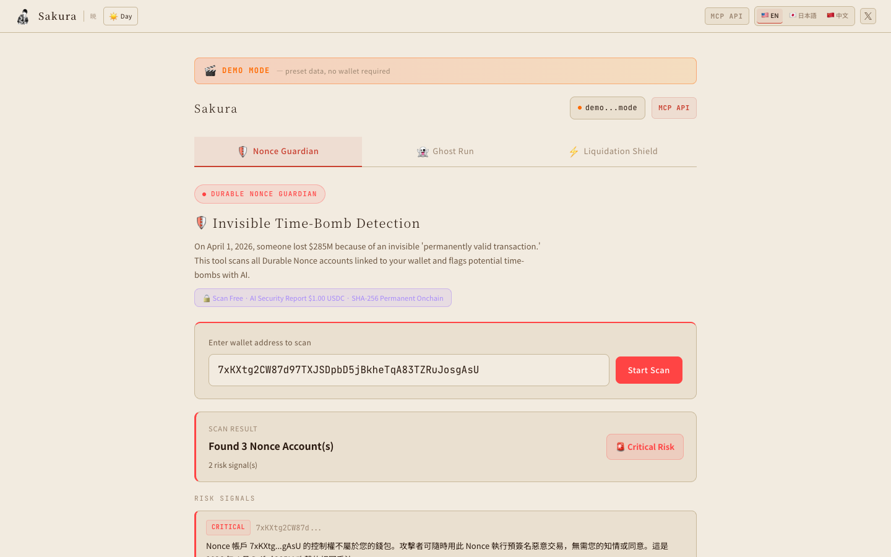
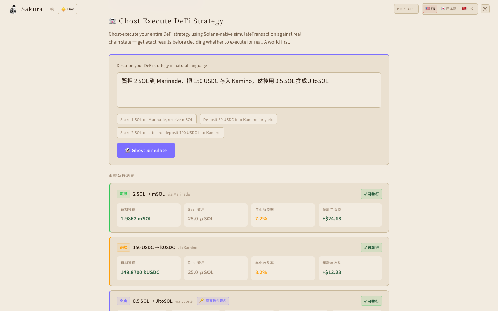
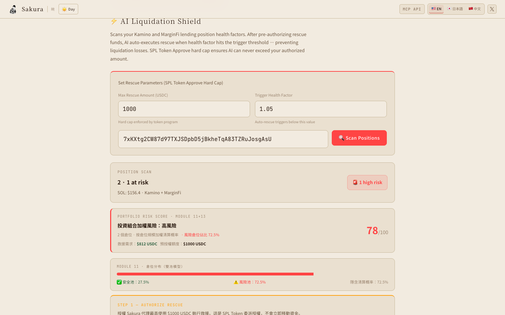

# Sakura — Solana AI Security Layer

> Three Solana-native AI protocols protecting your onchain assets.
> Built for [Colosseum Frontier Hackathon 2026](https://frontier.colosseum.org/) · April 6 – May 11

**Live demo (no wallet required):** `https://solis-app-sigma.vercel.app/?demo=true`

---

## Screenshots

| 🛡️ Nonce Guardian | 👻 Ghost Run | ⚡ Liquidation Shield |
|---|---|---|
|  |  |  |

---

## The Problem

On **April 1, 2026**, Drift Protocol lost **$285 million** in a single exploit using Durable Nonces — pre-signed transactions that never expire. The attacker had silently hijacked nonce account authority months earlier. No alarm went off.

Meanwhile, Solana's **$4B DeFi lending market** faces a second crisis: health factors can drop below 1.0 within minutes of a market move. Liquidation penalties are 5–10%. Users lose everything while they sleep.

Sakura uses the exact same Solana primitives attackers use — **turned into user protection**.

---

## Three Features

### 🛡️ Nonce Guardian — Invisible Time-Bomb Detection

Scans every Durable Nonce account linked to your wallet using `getProgramAccounts` — the same RPC call behind the Drift exploit. Detects:

- Nonce accounts whose authority was silently transferred to a foreign wallet (**Critical**)
- Fresh "burner" attacker addresses holding gas money (**High**)
- Active threat level via recent transaction history on each suspicious account

**Claude Sonnet 4.6** autonomously calls 6 Solana tools — profiling authority wallets, checking asset exposure, estimating total USD at risk — and outputs a security report with immediate action items.

**On-chain proof**: SHA-256 hash of every report is permanently written to Solana via the Memo Program. Independently verifiable.

**x402 payment gate**: AI report costs $1.00 USDC, paid on-chain, with sender verification and Redis-distributed replay protection.

---

### 👻 Ghost Run — DeFi Strategy Ghost Executor

The world's first multi-step DeFi pre-simulator for consumers. Describe a strategy in natural language — Claude parses it into steps, constructs real unsigned transactions, and runs `simulateTransaction` against **live mainnet state** before you sign anything.

**Example input:** *"Stake 2 SOL to Marinade, deposit 150 USDC into Kamino, then swap 0.5 SOL to JitoSOL"*

**Simulation output:**
- Exact token amounts: `1.9862 mSOL`, `149.87 kUSDC`, `0.4923 JitoSOL`
- Per-step APY: Marinade `7.24%`, Kamino `8.15%`, JitoSOL `8.92%`
- Total annual yield: `$43.72 USD`
- Gas cost: `0.000095 SOL ($0.0148)`
- Conflict detection across all steps
- Conditional orders: *"execute when SOL drops below $120"*

Claude then calls 5 more tools — checking wallet balances, live Jupiter prices, Solana inflation rate, and LST market depth — before writing a feasibility analysis.

On confirmation: SAK `stakeWithJup` / `lendAsset` executes the strategy. Jupiter swaps embed a 0.3% platform fee via the native integrator API.

---

### ⚡ Liquidation Shield — AI Rescue for At-Risk Lending Positions

Scans Kamino and MarginFi lending positions via `getProgramAccounts`. When health factor drops below your threshold (default 1.05):

1. Runs `simulateTransaction` to preview exact rescue repayment amounts
2. Shows health factor before/after, liquidation trigger price, rescue cost
3. **SPL Token `approve`** — a real on-chain hard constraint — authorizes the rescue agent to move up to your approved USDC limit
4. Agent executes rescue via delegate transfer, writes Memo audit chain referencing the original mandate transaction

**Example**: Kamino position at HF 1.03 (SOL $156.40, liquidation at $148.20 — only 5.2% downside). Sakura repays $812.40 USDC, restores HF to 1.42, saves $509–764 USDC in liquidation penalties. 1% performance fee only on success.

No other product rescues positions across Kamino + MarginFi with pre-authorized hard constraints and `simulateTransaction` preview.

---

## Technical Architecture

```
Next.js 16 (App Router, Turbopack)
├── app/api/
│   ├── nonce-guardian/          ← getProgramAccounts + 6-tool agentic Claude loop
│   ├── ghost-run/
│   │   ├── simulate/            ← Jupiter Quote + simulateTransaction engine
│   │   └── execute/             ← SAK stakeWithJup / lendAsset / Jupiter swap
│   ├── liquidation-shield/
│   │   ├── monitor/             ← Kamino + MarginFi health factor scan
│   │   └── rescue/              ← SPL delegate transfer + 1% performance fee
│   ├── mcp/                     ← MCP JSON-RPC 2.0 server (x402 gated, $1 USDC/call)
│   └── agent/memo/              ← Solana Memo Program audit writes
├── components/
│   ├── NonceGuardian.tsx
│   ├── GhostRun.tsx
│   └── LiquidationShield.tsx
└── lib/
    ├── nonce-scanner.ts         ← getProgramAccounts nonce detection
    ├── ghost-run.ts             ← simulateTransaction + Jupiter integration
    ├── liquidation-shield.ts    ← health factor scan + SPL approve builder
    ├── rpc.ts                   ← multi-RPC failover (Helius + fallbacks)
    ├── x402.ts                  ← on-chain USDC payment verification
    ├── redis.ts                 ← replay protection + per-wallet rate limiting
    └── demo-data.ts             ← preset data for ?demo=true recording mode
```

### Solana Primitives

| Primitive | Feature | Purpose |
|-----------|---------|---------|
| `getProgramAccounts` | Nonce Guardian, Shield | Scan nonce accounts & lending positions |
| `simulateTransaction` | Ghost Run, Shield | Pre-execute strategies and rescues |
| `SPL Token approve` | Shield | Hard-constraint rescue authorization |
| Solana Memo Program | All three | Immutable on-chain audit trail |
| `getSignaturesForAddress` | Nonce Guardian | Threat activity + authority profiling |
| `getInflationRate` | Ghost Run | Real yield vs nominal APY calculation |
| `getTokenSupply` | Ghost Run | LST protocol market depth |
| `getEpochInfo` | Shield | Epoch-boundary volatility context |
| `getAccountInfo` (80-byte decode) | Nonce Guardian | Raw nonce account authority extraction |

### AI Stack

- **Claude Sonnet 4.6** — strategy parsing, agentic tool loops (up to 6 iterations), risk analysis
- Each request: Claude autonomously selects and calls 5–7 Solana tools in parallel, iterates until confident
- All AI analysis output in Traditional Chinese (繁體中文)
- UI fully localized: English / 日本語 / 中文

---

## MCP Server

Sakura exposes a **Model Context Protocol (MCP) JSON-RPC 2.0 API** at `/api/mcp` — callable by Claude Desktop, Cursor, and any MCP-compatible client.

```bash
# Discover tools
curl https://solis-app-sigma.vercel.app/api/mcp

# Call a tool (requires x-payment: 1.00 USDC tx signature)
curl -X POST https://solis-app-sigma.vercel.app/api/mcp \
  -H "Content-Type: application/json" \
  -H "x-payment: <solana_tx_signature>" \
  -d '{
    "jsonrpc": "2.0",
    "id": 1,
    "method": "tools/call",
    "params": {
      "name": "sakura_nonce_guardian",
      "arguments": { "wallet": "<base58_address>" }
    }
  }'
```

**Tools**: `sakura_nonce_guardian` · `sakura_ghost_run` · `sakura_liquidation_shield`
**Payment**: $1.00 USDC per call, verified on-chain with sender authentication.

---

## Security

| Guard | Description |
|-------|-------------|
| x402 sender verification | Payment tx `authority` must match requesting wallet — no replay sharing |
| Redis replay protection | Distributed across all Vercel instances via `checkAndMarkUsed()` |
| Error sanitization | Helius URLs and Anthropic errors never reach the client (`console.error` only) |
| Input validation | All wallet addresses regex-validated; Claude output re-validated before execution |
| CSRF protection | `Origin` header checked on all rescue endpoints |
| Prompt injection defense | Token symbols from chain sanitized: `s.replace(/[^a-zA-Z0-9]/g, "").slice(0, 20)` |
| Official mint registry | Positions with unknown token symbols flagged before AI processing |
| Multi-RPC failover | `getConnection()` auto-selects healthiest endpoint; zero `new Connection()` in routes |
| Per-wallet rate limiting | Redis-keyed limits (Ghost Run: 20/hr, Shield: 12/hr) prevent Sybil amplification |
| `Number.isFinite` guards | All numeric inputs from user/chain validated before math operations |

---

## Revenue Model

| Stream | Mechanism | Rate |
|--------|-----------|------|
| AI Security Report | x402 USDC payment, verified on-chain | $1.00 / report |
| MCP API | x402 USDC payment per tool call | $1.00 / call |
| Swap execution | Jupiter native integrator fee | 0.3% of output |
| Liquidation rescue | Performance fee on successful rescue only | 1% of rescued USDC |

---

## Demo Mode

Visit `/?demo=true` — no wallet required. All three features auto-load with preset dramatic data instantly.

```
https://solis-app-sigma.vercel.app/?demo=true
```

Includes: CRITICAL foreign-authority nonce threat, Ghost Run 3-step simulation ($43.72/yr yield), Kamino position at HF 1.03 near liquidation.

---

## Local Development

```bash
git clone https://github.com/brianlauquedic/solis-app
cd solis-app
npm install
cp .env.example .env.local   # fill in your keys
npm run dev
# → http://localhost:3001
# → http://localhost:3001/?demo=true
```

### Environment Variables

```env
# Required
ANTHROPIC_API_KEY=           # Claude Sonnet 4.6
HELIUS_API_KEY=              # Solana RPC (primary)

# Required for execution features
SAKURA_AGENT_PRIVATE_KEY=    # Agent keypair as JSON number array (64 bytes)
SAKURA_FEE_WALLET=           # Fee collection wallet (base58)
NEXT_PUBLIC_BASE_URL=        # https://solis-app-sigma.vercel.app

# Optional (Redis for distributed rate limiting + replay protection)
UPSTASH_REDIS_REST_URL=
UPSTASH_REDIS_REST_TOKEN=

# Optional
INTERNAL_API_SECRET=         # Internal API route auth
```

---

## Stack

- **Next.js 16** (App Router, Turbopack) · TypeScript · React 19
- **@solana/web3.js** · **@solana/spl-token**
- **@anthropic-ai/sdk** — Claude Sonnet 4.6, agentic loops
- **Solana Agent Kit (SAK)** — `stakeWithJup`, `lendAsset`
- **Jupiter Aggregator v6** — swap quotes, price feeds, 0.3% platform fee
- **Upstash Redis** — distributed rate limiting + replay protection
- **Vercel** — serverless deployment, `maxDuration: 60/120`

---

## Hackathon

**Colosseum Frontier Hackathon 2026** · Track: AI + Solana DeFi Security

**Core thesis**: Solana has unique primitives — `simulateTransaction`, `getProgramAccounts`, Durable Nonces — that no other chain has. Sakura uses these primitives defensively: turning the exact tools attackers use into user protection.

**Verified competitive gap** (researched April 2026):
- Nonce Guardian: existing tools only scan transaction history; none detect live authority hijacking
- Ghost Run: no consumer product does multi-step pre-simulation before signing
- Liquidation Shield: Apricot Assist only covers its own X-Farm; no cross-protocol (Kamino + MarginFi) rescue with SPL `approve` hard constraints exists

---

*© 2026 Sakura AI · Built on Solana*
